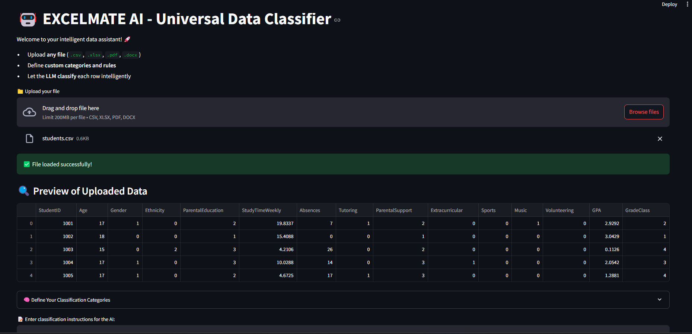
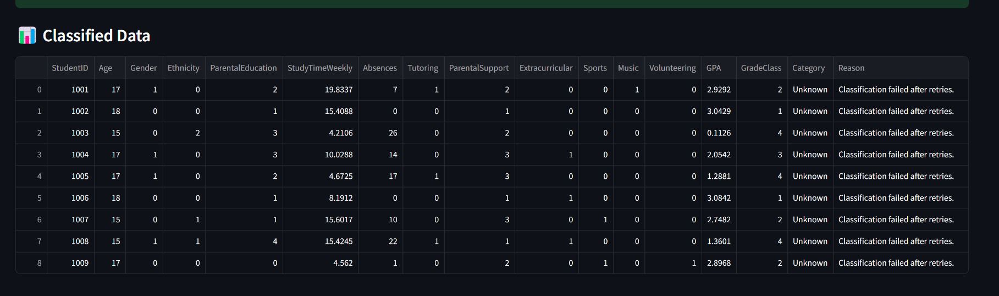

# Excelmate AI

Welcome to Excelmate AI, a smart assistant designed to automate Excel file updates using natural language text commands. This AI-powered tool leverages Natural Language Processing (NLP) and Machine Learning to recognize, classify, and act on user instructions—making Excel management fast and intuitive.

Whether you're an educator managing student records or a professional tracking tabular data, Excelmate AI transforms commands into structured actions for updating Excel files in real-time.


## Table of contents
- [Features](#features)
- [Technologies Used](#technologies-used)
- [Installation](#installation)
- [Usage](#usage)
- [Project Structure](#project-structure)
- [How It Works](#how-it-works)
- [Configuration](#configuration)
- [Contributing](#contributing)
- [License](#license)
- [Acknowledgements](#acknowledgements)
## Features
- **Text Command Recognition**: Accepts user instructions via text input.

- **Command Classification**: Classifies text commands into specific update categories using a trained NLP model.

- **Automated Excel Editing**: Updates cells, finds data, or makes corrections in Excel files via Pandas and OpenPyXL.

- **Text Feedback Output**: Responds with console-based confirmations.

- **Preloaded Dataset for Testing**: Includes `sample_data.csv` for quick demo or testing.


## Technologies Used

- Python 3.8+

- Flask

- nltk

- scikit-learn

- pandas

- joblib

- OpenPyXL


## Installation

**Prerequisites**
- Python 3.8 or higher

- pip

**Steps**

**1.Clone the Repository**
```bash
git clone https://github.com/your-username/ExcelmateAI.git
cd ExcelmateAI/excelmate_ai
```

**2. Create Virtual Environment**

```bash
python -m venv venv
venv\Scripts\activate  # On Windows
# OR
source venv/bin/activate  # On Linux/Mac
```
**3. Install Dependencies**

```bash
pip install -r requirements.txt
```
**4. Run the Application**

```bash
python app.py
```


    
## Usage

- Type commands like:

   - "Update student grades"

   - "Find missing attendance records"

- The app will:

  - Classify the intent

  - Perform updates on the Excel sheet

  -  Respond with a confirmation in the console


## Project Structure
```
excelmate_ai_package/

├── excelmate_ai/
│   ├── app.py               # Main application entry
│   ├── classifier.py        # Command classification logic
│   ├── requirements.txt     # Project dependencies
│   └── sample_data.csv      # Sample dataset for testing

└── venv/                    # Virtual environment (optional)
```
## How It Works

**1. Text Input**: Commands are typed by the user.

**2. Classification**: Text is processed using a trained NLP model to determine the user's intent.

**3.Excel Action**: Based on intent, data is updated/queried using Pandas/OpenPyXL.

**4.Feedback**: Result is shown in the terminal.
## Screenshots





## Acknowledgements

 - **NLTK & Scikit-learn**: For NLP-based intent classification
 - **Pandas/OpenPyX**L: For Excel manipulation
 - **Flask**: For making this app web-compatible

Empower your Excel workflow with Excelmate AI! 🎯 
